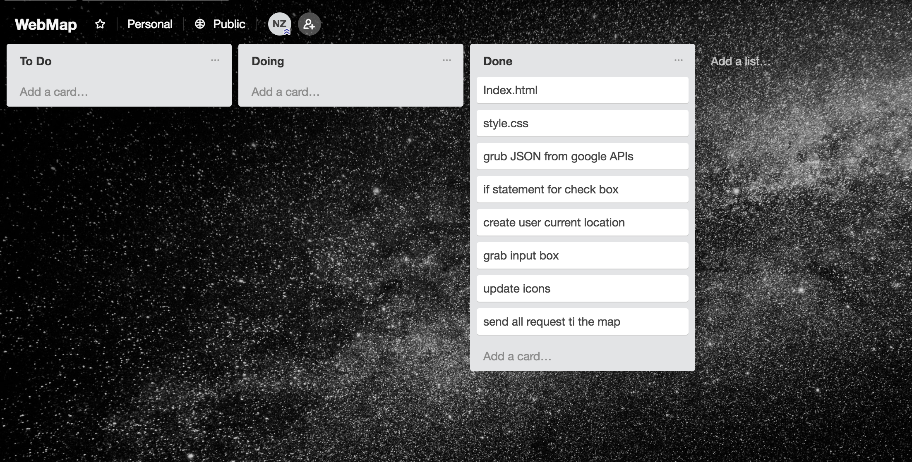

<!--  -->


# Frontend Project WebMap
Web map where user can find place with they need near him. The main idea works with google maps, location and see how its works for website. I want to grab API of diferen place and send to the map on main part of my Web page


## Setup

```sh
yarn # install dependencies
```

# Local Development

```sh
yarn start
```

# Deployment

```sh
yarn deploy  #   means npm run build && firebase deploy 

```

# WebMap 


[WebMAp](https://webmap-69d43.firebaseapp.com/)

# Presentation   

[Presentation](https://prezi.com/p/6asge3nqgrxa)

# Trello 


[Trello](https://trello.com/b/HICGyTdj/webmap)


